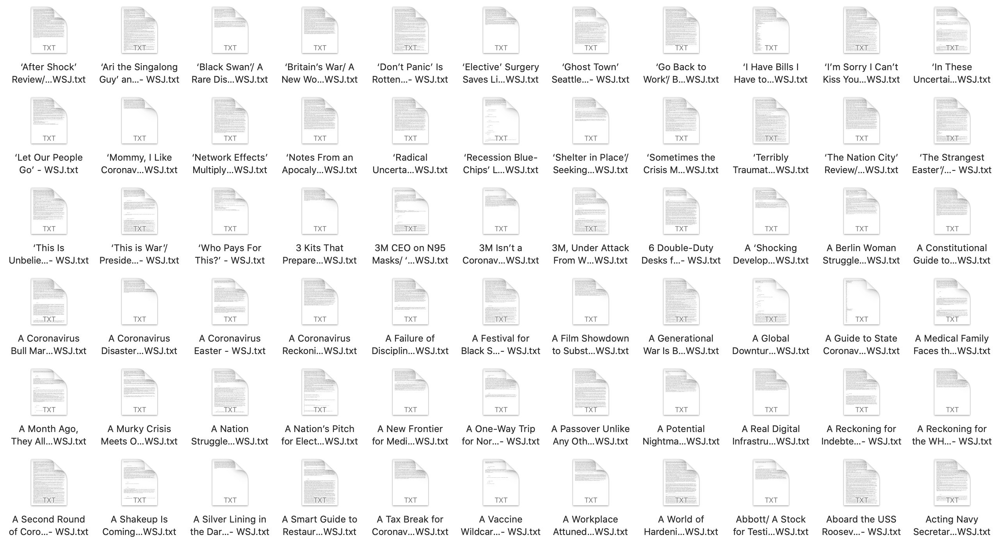

# wsj_scraper
 web scraper for wsj news 
you should use your own proxy and cookie, 
you can change the loop [1,80] to whatever pages you want
If you have some questions, feel free to contact[email:brayntyin@163.com],[wechat:Dick9233]

